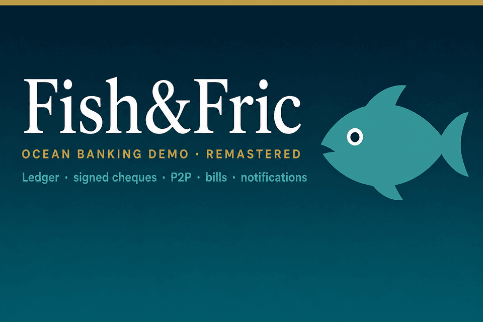
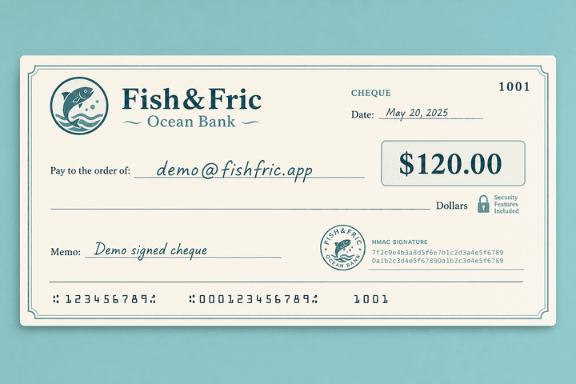

# Fish&Fric (remastered)

<p align="center">
  
</p>

Full-stack remaster of **Fish&Fric**, an ocean-themed online banking demo. Recruiters can explore it live: accounts, transfers, P2P, bill pay, and **HMAC-signed cheque deposits** on a real cent-based ledger.

> **Fictional data only.** All users, balances, transfers, and transactions are fake. Do not enter real banking credentials or personal financial information.

## Story

| | |
|---|---|
| **2024** | Original **ÉTS integrator team project** - [FishFric-Bank](https://github.com/RomainBoiret/FishFric-Bank) |
| **2026** | Solo remaster for portfolio review - this repo |
| **Now** | Live demo with a stricter domain layer, notifications, and one-time cheque clearing |

## Highlights

| Feature | What it does |
|---------|----------------|
| Accounts | Checking, savings, Shark Card (open rules enforced) |
| Transfers | Double-entry ledger writes between your own accounts |
| P2P | Send funds locked behind a security question |
| Bill pay | Demo payees → `BILL_PAYMENT` ledger entries |
| Cheque deposit | Server-issued SVG, payee + HMAC + one-time clear |
| Alerts & history | Capped inbox / histories: dismiss one or clear all |

### Signed cheque (illustration)

<p align="center">
  
</p>

Issue → download to your PC → deposit once. Re-uploading the same file is rejected.

## Stack

- **Next.js** (App Router) + TypeScript + Tailwind CSS
- **PostgreSQL** (Neon) + **Prisma**
- **Auth.js** (credentials + JWT sessions)
- Lightweight domain layer (`src/domain`) with an **immutable ledger**

## Local setup

```bash
cp .env.example .env
# Set DATABASE_URL, DIRECT_URL, and AUTH_SECRET

npm install
npm run db:migrate
npm run db:seed
npm run dev
```

Open [http://localhost:3000](http://localhost:3000) - or read the in-app story at `/docs`.

### Demo credentials

| Account | Email | Password |
|---------|-------|----------|
| Demo | `demo@fishfric.app` | `Demo-FishFric-2026!` |
| Friend (P2P) | `ami@fishfric.app` | `Demo-FishFric-2026!` |

One-click demo from the landing page logs in as the Demo account.

## Ledger integrity

`BankAccount.balanceCents` is a denormalized cache. The source of truth is the immutable `LedgerEntry` stream (amounts in cents, signed).

```bash
# Pure domain tests (no database)
npm test

# Reconcile every account against Σ LedgerEntry (needs DATABASE_URL)
npm run db:verify-ledger
```

The verify script exits non-zero if any cached balance drifts from the ledger sum.

## Deploy (Vercel)

1. Import this repo on [vercel.com](https://vercel.com)
2. Set environment variables:
   - `DATABASE_URL` - Neon **pooled** URL (host includes `-pooler`)
   - `DIRECT_URL` - Neon **direct** URL (same credentials, host **without** `-pooler`) - required for migrations
   - `AUTH_SECRET` - Auth.js secret
3. Deploy - the build runs migrations (advisory lock disabled for Neon) then `next build`
4. Seed production once: `npm run db:seed` (with `DATABASE_URL` pointing at Neon)

> If the build fails with `P1002`, check that `DIRECT_URL` has no `-pooler` host. `scripts/migrate-deploy.mjs` already disables Prisma advisory locking.

## Quality gate (Lighthouse)

`.github/workflows/lighthouse.yml` audits the public routes (`/`, `/login`, `/signup`, `/docs`) with [Lighthouse CI](https://github.com/GoogleChrome/lighthouse-ci):

- On PRs, it waits for the Vercel preview deployment and audits that URL.
- On pushes to `main`, on a weekly schedule, and on manual dispatch, it audits production.
- Thresholds live in [`.lighthouserc.json`](./.lighthouserc.json): accessibility, best practices, and SEO must score ≥ 90 (build fails otherwise); performance warns below 80.

## Project layout

```
docs/assets/      # README illustrations (banner, sample cheque PNGs)
prisma/           # schema, migrations, seed
scripts/          # migrate + ledger verify helpers
src/
  app/            # Next.js routes (incl. /docs)
  domain/         # pure business rules (+ ledger integrity)
  features/       # auth, accounts, transfers, p2p, deposits, bills…
  lib/            # prisma, auth, shared utils
```

## Links

- Remaster (this repo): https://github.com/RomainBoiret/FishFric-remastered
- Original team project: https://github.com/RomainBoiret/FishFric-Bank

## License

MIT
